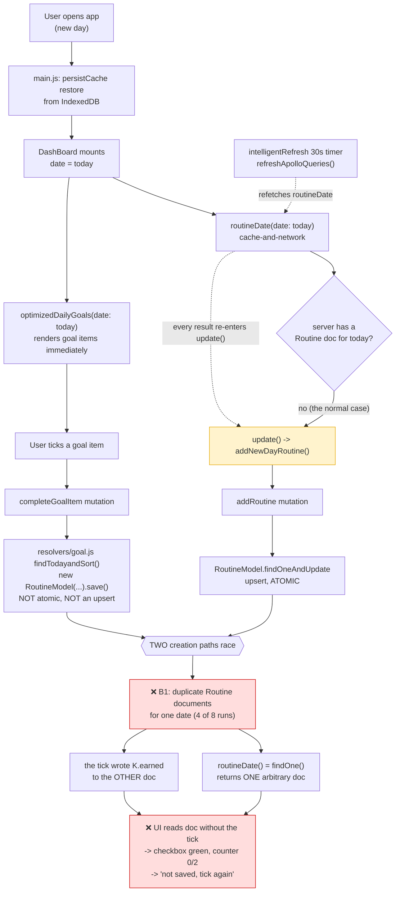
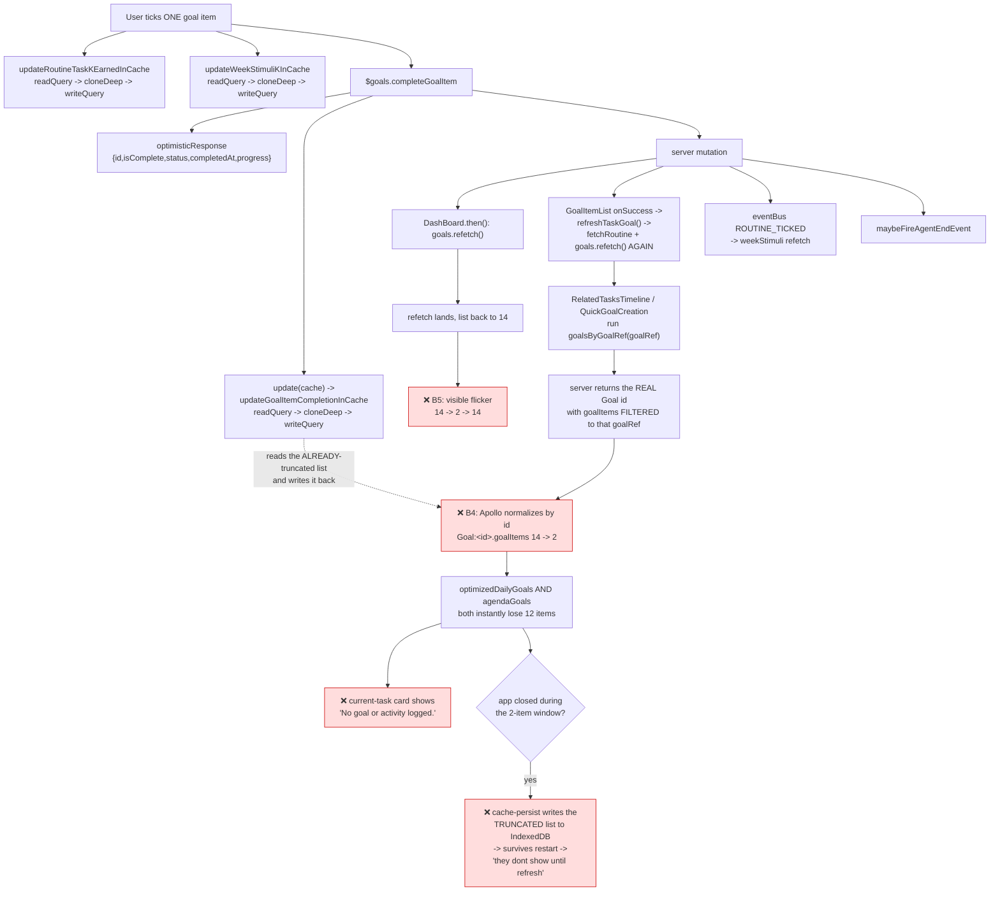
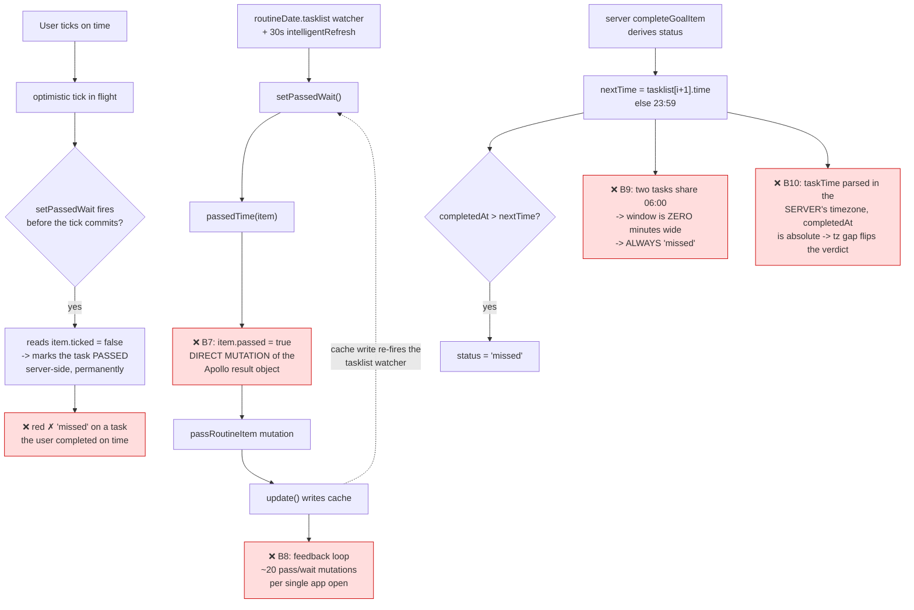
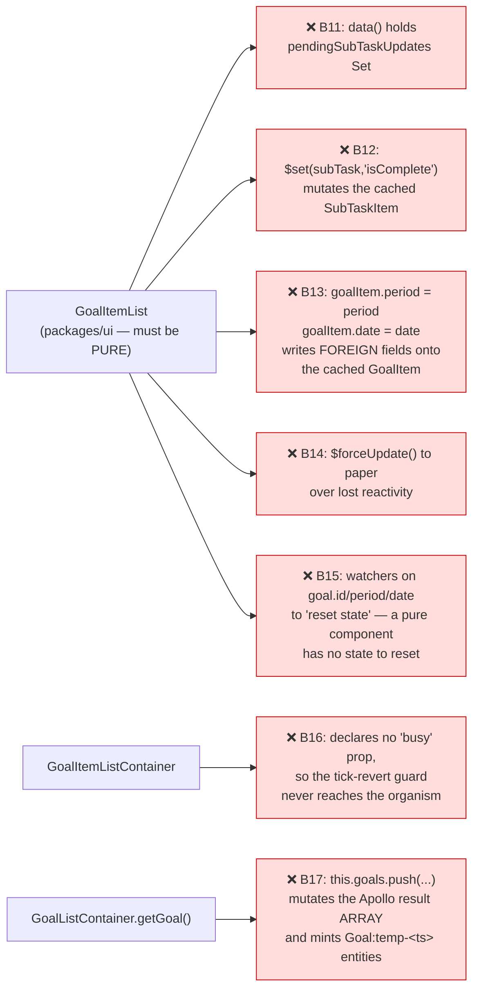

# Current flow (broken) — where the cache goes wrong

> Investigated 2026-07-28 against live data on `grvpanchalus@gmail.com`, with the
> account stacked to a realistic shape: 7 routine tasks, 7 week goals, 14 day
> goals. Every ❌ below is **reproduced**, not inferred — the evidence for each is
> in [`03-evidence.md`](./03-evidence.md).

---

## 1. Cold open on a NEW DAY

This is the path behind *"New Day first check goes green but it is not saved and
I have to tick again."*



**❌ B1 — Two routine-creation paths, one non-atomic.**
`resolvers/routine.js#addRoutine` is a proper atomic `findOneAndUpdate(..., {upsert:true})`.
`resolvers/goal.js#findTodayandSort` is `new RoutineModel(...).save()` — a plain
insert with no uniqueness guard. On a new day both fire concurrently and Mongo
happily stores two documents for the same `(email, date)`.
*Measured: 4 of 8 forced runs produced duplicates. The account already carries a
historical duplicate on `27-01-2026`.*

**❌ B2 — `addNewDayRoutine()` is called from an Apollo `update()` callback with no guard.**
`update()` runs on **every** result for that query — the cache pass, the network
pass, and every one of the 30-second `refreshApolloQueries()` refetches. A single
new-day open fired `addRoutine` **three times**.

**❌ B3 — Nobody downstream knows the routine id is provisional.**
`checkClick()` sends `id: this.did` with no guard (`skipClick` *does* guard, so the
omission is inconsistent). Before `routineDate` resolves, `did` is `''` — and after
a mid-session midnight rollover it still holds **yesterday's** routine id.

---

## 2. The tick fan-out — one checkbox, ~8 cache writers

This is where the store actually gets corrupted.



**❌ B4 — `goalsByGoalRef` truncates a shared normalized entity.**
The resolver deliberately maps `_id` back onto `id` (to fix an older bug where
every Goal resolved `id:null` and collapsed into one entity) — but it *also*
filters `goalItems`. So it now returns **the real `Goal:<id>` with a subset of its
items**, and Apollo replaces the whole list. This violates
`containers/ARCHITECTURE.md` §3 principle #2 verbatim: *"Returning a partial
`Goal { goalItems }` array replaces the normalized list and drops siblings."*
*Measured live: `Goal:6a68a3a2…4299` went 14 → 2 on a single tick.*

**❌ B5 — `readQuery → cloneDeep → writeQuery` cements whatever it reads.**
`useApolloCacheUpdates.js` (1051 lines, 14 `writeQuery` calls) re-writes an entire
query result. When it runs *after* B4 it reads the truncated 2-item list and
writes it back into `optimizedDailyGoals`, turning a transient corruption into a
committed one.

**❌ B6 — Redundant refetch storm.** One tick triggers `goals.refetch()` twice
(once in `DashBoard.completeGoalItem.then`, once via `refreshTaskGoal`), plus
`fetchRoutine`, plus a `weekStimuli` refetch. Each is a `cache-and-network` read
that can land after a later tap and revert it.

---

## 3. `passed` / `wait` — the "missed" state

This is the path behind *"Routine should not have missed state if the agent failed
and I ticked on time."*



**❌ B7 — Direct mutation of Apollo-owned objects.** `passedTime`/`waitTime` do
`item.passed = true` / `item.wait = false` on objects handed out by the cache
reader. Apollo 2 memoizes those result objects, so this edits the cache's own
memoized copy behind its back — the store and what components read now disagree.

**❌ B8 — Write-triggers-read feedback loop.** Every `passRoutineItem` `update()`
writes the cache → the `routineDate.tasklist` watcher fires → `setPassedWait()`
runs again before the previous responses land. *Measured: one new-day open fired
7 `passRoutineItem` + 11 `waitRoutineItem` mutations, several duplicated, with
`wait` visibly oscillating true→false→true.*

**❌ B9 — Zero-width completion window.** `Wake Up` and `Morning movement` are both
at `06:00`. For `Wake Up`, `nextTime === taskTime`, so *any* completion is
`isAfter(nextTime)` → `missed`. **Confirmed live: ticking a `Wake Up` goal item
returned `status: "missed"`.**

**❌ B10 — Timezone-relative window, absolute timestamp.**
`moment(task.time,'HH:mm')` resolves in the **server's** local zone; `completedAt`
is `new Date()`. On Lambda (UTC) with an IST user that is a 5h30m error in the
grading window.

---

## 4. `GoalItemList` is not a dumb component



**❌ B17 — leaked optimistic entities, persisted forever.**
`addGoalItemToCache` mints `Goal:temp-${Date.now()}-${period}` when it can't find
the period goal. Nothing ever evicts them, and cache-persist writes them to disk.
**Found live in IndexedDB:** `Goal:temp-1784926878068-day`,
`Goal:temp-1784932579395-week`, `Goal:temp-1784982393521-day` — placeholders from
the 24th and 25th of July still shadowing real goals four days later. Plus one
mistyped `RoutineItemRef:69786b1f2194f43110ac1529` entity.

---

## 5. Why closing the app makes it permanent

```mermaid
sequenceDiagram
    participant U as User
    participant V as Vue/UI
    participant A as Apollo cache
    participant P as cache-persist (IndexedDB)
    participant S as Server

    U->>V: tick a goal item
    V->>A: optimistic write (14 items intact)
    V->>S: completeGoalItem
    S-->>V: ok
    V->>S: goalsByGoalRef(goalRef)
    S-->>A: Goal:&lt;id&gt; with 2 of 14 items
    Note over A: ❌ normalized list truncated 14 → 2
    A->>P: debounced persist (1s) writes the BAD slice
    V->>S: goals.refetch()
    Note over U: if the user closes the app in this window…
    U->>V: app closed
    S-->>A: (response never applied)
    Note over P: ❌ IndexedDB now holds 2 items — permanently
    U->>V: reopen tomorrow
    P-->>A: restore 2 items
    Note over V: ❌ "goal items dont show until refresh"
```

`persistCache` is configured with `maxSize: false` and the default `trigger:'write'`
(1s debounce). It has **no schema version and no purge on restore**, so every
corrupt slice and every leaked `temp-` entity is carried forward across app
restarts and across days.

---

## Defect index

| id | Layer | Defect | Symptom reported |
|----|-------|--------|------------------|
| B1 | server | non-atomic `findTodayandSort` races atomic `addRoutine` → duplicate Routine docs | #1 tick not saved |
| B2 | web | `addNewDayRoutine()` unguarded inside `update()` → fires 3× | #1 |
| B3 | web | `checkClick` uses `this.did` with no readiness guard | #1 |
| B4 | server | `goalsByGoalRef` returns real Goal id + filtered `goalItems` | #3 flicker / not shown |
| B5 | web | `readQuery→cloneDeep→writeQuery` cements truncated reads | #3 |
| B6 | web | duplicate `goals.refetch()` per tick + `fetchRoutine` | #1, #3 |
| B7 | web | `passedTime`/`waitTime` mutate Apollo result objects in place | #2 |
| B8 | web | cache write → watcher → `setPassedWait` feedback loop (~20 mutations/open) | #2 |
| B9 | server | tasks sharing a start time get a zero-width window → always `missed` | #2 |
| B10 | server | window in server tz vs absolute `completedAt` | #2 |
| B11–B15 | ui | `GoalItemList` holds local state and mutates cached entities | all three |
| B16 | web | `GoalItemListContainer` drops the `busy` prop | #1 |
| B17 | web | `Goal:temp-*` entities leaked and persisted | #3 |
| B18 | server | `completeSubTaskItem` is typed `GoalItem` but returns the sub-task shape → `id: null`, `subTasks: null`; unnormalizable, and its `isComplete` is the parent's | subtask ticks needing manual cache surgery to survive |

**B18 was found during the pre-deployment check**, after making `GoalItemList`
pure removed the client-side patching that had been compensating for it. Fixed in
`resolvers/subTaskItem.js` (returns the complete parent goal item); guard R4.
