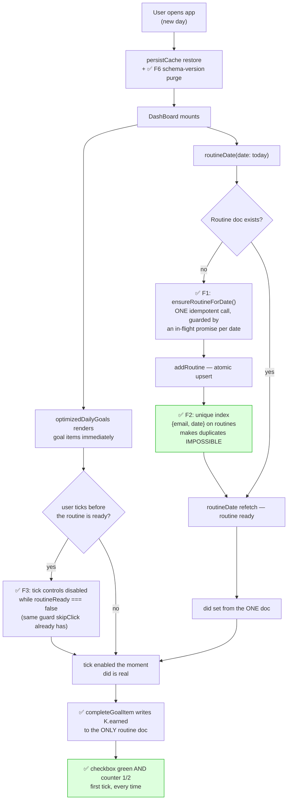
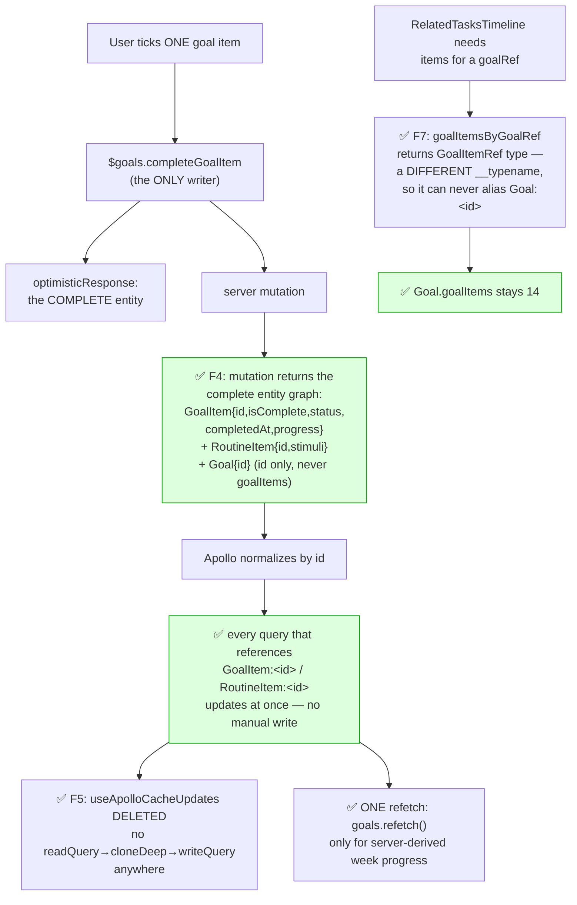
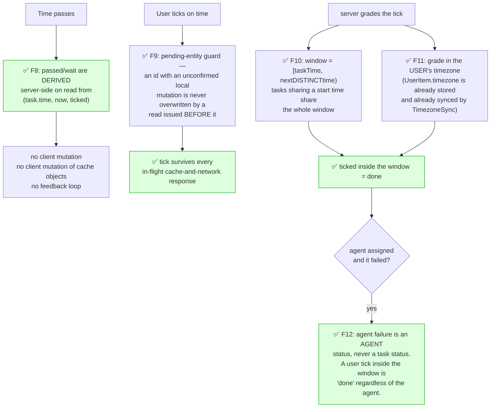
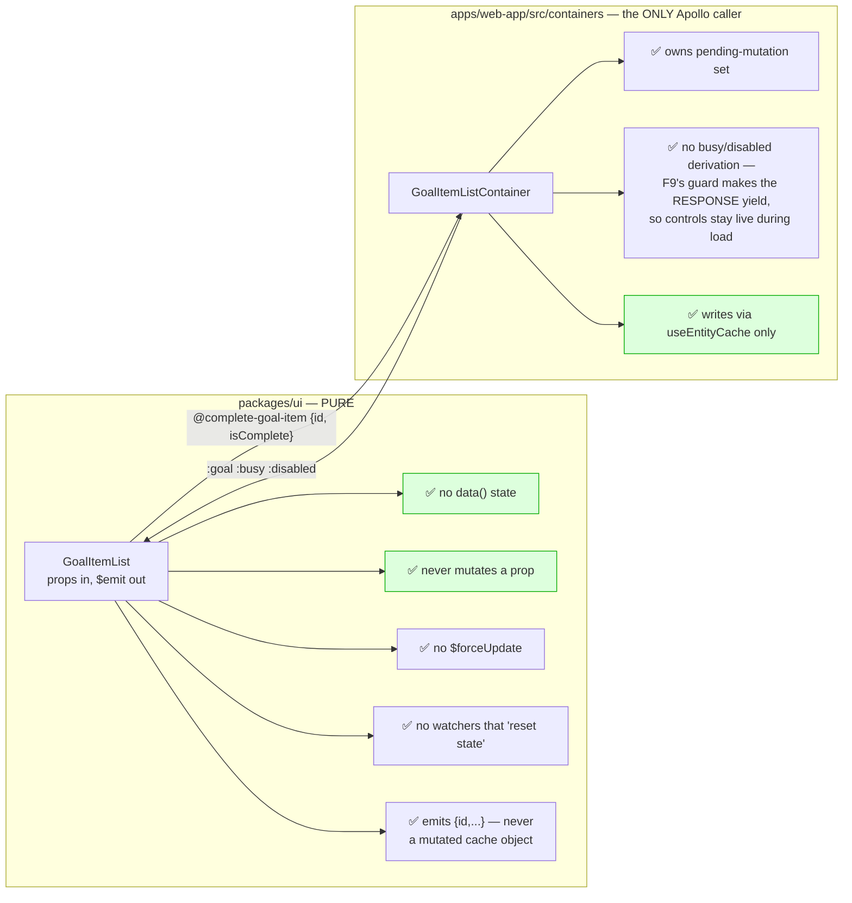
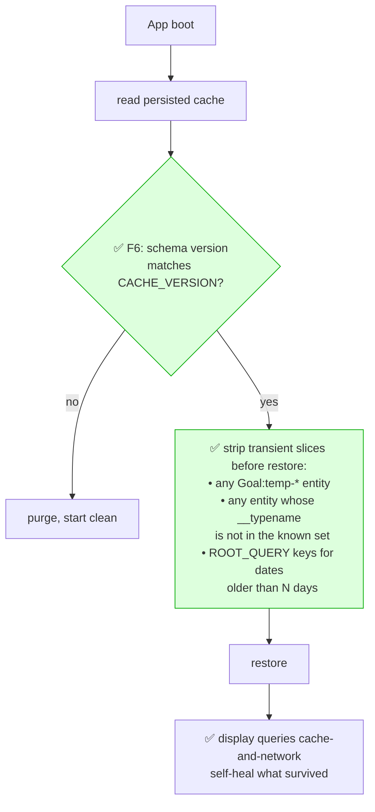

# Corrected flow — one writer per fact

> The target design for the flows in [`01-current-flow-broken.md`](./01-current-flow-broken.md).
> It is the existing `containers/ARCHITECTURE.md` principles actually enforced,
> plus the two server-side contracts that make them possible.

## The rule that removes the whole bug class

> **Every fact has exactly one writer, and that writer writes it by entity id.**

Today a single tick has ~8 writers for overlapping facts, so correctness depends
on which one finishes last. Below, each fact has one owner and the ordering stops
mattering.

| Fact | Single writer | Mechanism |
|------|---------------|-----------|
| `GoalItem.isComplete/status/completedAt` | `completeGoalItem` mutation result | Apollo auto-normalization (no manual write) |
| `RoutineItem.stimuli` | same mutation, extended return shape | Apollo auto-normalization |
| `RoutineItem.ticked` | `tickRoutineItem` mutation result | Apollo auto-normalization |
| `RoutineItem.passed/wait` | server, derived on read | never client-written |
| `Goal.goalItems` (list membership) | only the canonical `optimizedDailyGoals` / `agendaGoals` queries | scoped queries return a different type |
| week-goal progress | server `autoCheckTaskPeriod` | refetch, never optimistic |

---

## 1. Cold open on a new day — corrected

- **F1** — one `ensureRoutineForDate(date)` helper that memoizes its in-flight
  promise per date. `update()` may call it on every result; it fires at most one
  mutation. Replaces the unguarded `addNewDayRoutine()` in the Apollo callback.
- **F2** — `RoutineSchema.index({ email: 1, date: 1 }, { unique: true })`. This is
  the load-bearing fix: it makes B1 *unrepresentable* rather than merely unlikely,
  and turns the non-atomic `findTodayandSort` insert into a caught duplicate-key
  error that retries into a read.
- **F3** — `routineReady` computed (`!!did && !isRoutineBusy`) gating the tick
  circle and goal checkboxes, exactly as `skipClick` already gates itself.

---

## 2. The tick — corrected

- **F4** — extend the mutation return shape (ARCHITECTURE.md §3 principle #2).
  Returning the complete entity is what makes every manual cache write
  unnecessary. **Never return a partial list field.**
- **F5** — once F4 lands, `useApolloCacheUpdates.js` has no reason to exist. Until
  then, any write left in it must go through `useEntityCache.patchGoalItem` /
  `patchRoutineItem` (writeFragment by id), never `writeQuery`.
- **F7** — the general rule: **a scoped/filtered projection of an entity must not
  reuse that entity's `__typename:id`.** Either return the full list, or return a
  distinct type (`GoalItemRef`, `TimelineEntry`). This is the single change that
  fixes the reported flicker.

### Choosing between F7's two options

| Option | Cost | When |
|--------|------|------|
| Return the **full** `goalItems` and filter client-side | one extra payload, zero schema churn | quick fix, ships today |
| Return a **distinct type** (`GoalItemRef`) | schema + 3 container updates | correct long-term; scoped reads stay cheap |

Ship the first, land the second.

---

## 3. `passed` / `wait` / `missed` — corrected

- **F8** — the strongest simplification available. `passed` and `wait` are pure
  functions of `(task.time, now, task.ticked)`. Persisting them means the client
  must write them, which is what created B7 and B8. Derive them in the
  `routineDate` resolver and the ~20 mutations per app open become **zero**.
  *(Keep `passedPoints` persisted — it is a real snapshot, not a derivation.)*
- **F9 — SHIPPED.** The pending-entity guard, named as the north star in
  `ARCHITECTURE.md` §3 principle #7. It replaces disabling controls during load
  (the `busy` prop, now deleted) with something that cannot lose a tick.

  Implementation: `utils/cacheGuard.js` (the registry) + `apollo/guardLink.js`
  (an `ApolloLink` installed outermost in the chain, so it is the last thing to
  touch a response before Apollo normalizes it).

  The rule is *the request that left last wins*. Every operation is stamped with
  a monotonic sequence when it leaves; a mutation result confirms every entity
  it carries at a later sequence; and a query payload is rewritten on the way
  back so guarded fields keep their local value — but only for payloads whose
  request predates that confirmation. Guards drop as soon as no older request is
  still out (usually milliseconds), and unconditionally after 20s, so a hung
  request can never pin stale state.

  Two halves:
  - **automatic** — `captureFromResult` in the link confirms every entity in
    every mutation result. Zero call-site changes; this is what protects
    `passRoutineItem`, `waitRoutineItem`, `tickRoutineItem` and the rest.
  - **explicit** — `guardFields()` at the three interaction sites, for fields a
    mutation does not return. `completeGoalItem` omits `progress` (that is the
    F4 gap), so the client claims it directly; `releaseEntity()` on failure
    drops the claim alongside Apollo's own optimistic rollback.

  Scalars only — a guarded field is never a list or object. Reshaping a list
  from the client is how the cache got corrupted in the first place (B5).

  Guards: `src/apollo/__tests__/guardLink.test.js` runs the race inside a real
  Apollo Client and **includes a control that asserts the unguarded chain still
  reverts** — if that control ever passes, the test has stopped proving
  anything. `e2e/cache-integrity.spec.js` R5 does the same end-to-end by holding
  every query response for 4s while letting the mutation through, and asserts
  nothing on screen is `disabled` during that window.
- **F10/F11/F12** — grade lateness against the next *distinct* time, in the user's
  zone, and keep agent outcomes out of task status entirely.

---

## 4. `GoalItemList` as a genuinely pure organism

Concretely, in `GoalItemList.vue`:

| Remove | Because |
|--------|---------|
| `data() { pendingSubTaskUpdates }` | in-flight tracking is the container's job (`pendingMutations` already exists) |
| `this.$set(subTask, 'isComplete', v)` | mutates a cached `SubTaskItem`; the optimistic response already does this correctly |
| `goalItem.period = period; goalItem.date = date` | writes fields the `GoalItem` type doesn't have onto the cached entity — emit `{ item, period, date }` instead |
| `this.$forceUpdate()` | only needed because the mutations above break reactivity |
| `watch: 'goal.id' / 'goal.period' / 'goal.date' → resetState()` | a pure component has no state to reset |
| `console.log` in `created`/`beforeDestroy`/every handler | noise in a shipped organism |

And in `GoalItemListContainer.vue`: **add the `busy` prop** it currently drops, so
the tick-revert guard reaches the organism through the container path too.

---

## 5. Persistence — corrected

Persisting a normalized cache with no version and no purge means **one bad write is
permanent**. F6 bounds the blast radius of every future cache bug to a single
session.

---

## Fix index, ordered by (impact ÷ risk)

| # | Fix | File | Risk | Kills | Status |
|---|-----|------|------|-------|--------|
| F2 | unique index `{email, date}` on routines | `schema/RoutineSchema.js` | low | B1 | shipped (index not yet built) |
| F10 | window = next **distinct** time | `resolvers/goal.js` | low | B9 | shipped |
| F11 | grade in the user's timezone | `resolvers/goal.js` | low | B10 | shipped |
| F7a | `goalsByGoalRef` returns full `goalItems` | `resolvers/goal.js` | low | **B4 — the flicker** | shipped |
| F1 | `ensureRoutineForDate()` in-flight guard | `DashBoard.vue` | low | B2 | shipped |
| F3 | `routineReady` gate on tick controls | `DashBoard.vue` | low | B3 | **superseded by F9** |
| — | drop the duplicate `goals.refetch()` | `DashBoard.vue` | low | B6 | shipped |
| — | make `GoalItemList` pure | `packages/ui`, `containers/` | low | B11–B16 | shipped |
| F6 | cache version + purge on restore | `main.js` | med | B17, permanence | shipped |
| F9 | pending-entity guard | `utils/cacheGuard.js`, `apollo/guardLink.js` | high | the whole revert class | **shipped** |
| F8 | derive `passed`/`wait` server-side | `resolvers/routine.js`, `DashBoard.vue` | med | B7, B8 | deferred |
| F4 | complete entity in mutation returns | `resolvers/goal.js` | med | B5 | partial (`completeSubTaskItem` only) |
| F5 | delete `useApolloCacheUpdates.js` | `composables/` | med | B5 | deferred (blocked on F4) |
| F7b | distinct type for scoped projections | `resolvers/goal.js` + schema | med | B4 permanently | deferred (F7a covers it) |

**Sequencing:** F2 + F10 + F11 + F7a are four small server edits that resolve all
three reported symptoms. Everything below them is the structural work that stops
the class from recurring.

**F3 was superseded, not reverted.** It gated the tick controls on a
`routineReady` flag (shipped as `did` + the `busy` prop), which closed the race
by removing the interaction — at the cost of a dead tap on every app-open, since
the dashboard is at its most tappable exactly when it is also refetching. F9
closes the same race by making the *response* yield instead, so the gate came
out: no `busy` prop anywhere, and `checkClick`/`skipClick` now **wait** for the
routine document id (`ensureRoutineId`) rather than refusing the tap.
